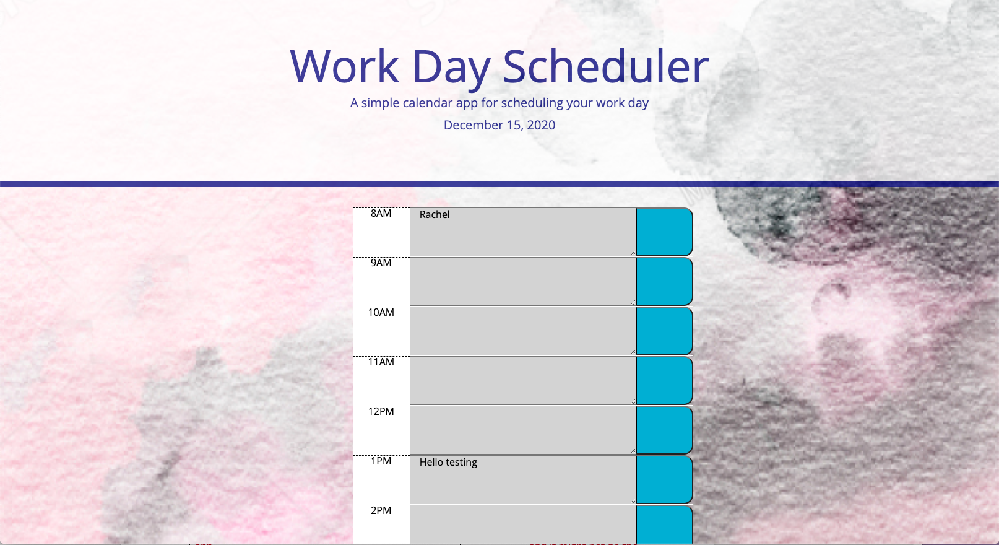
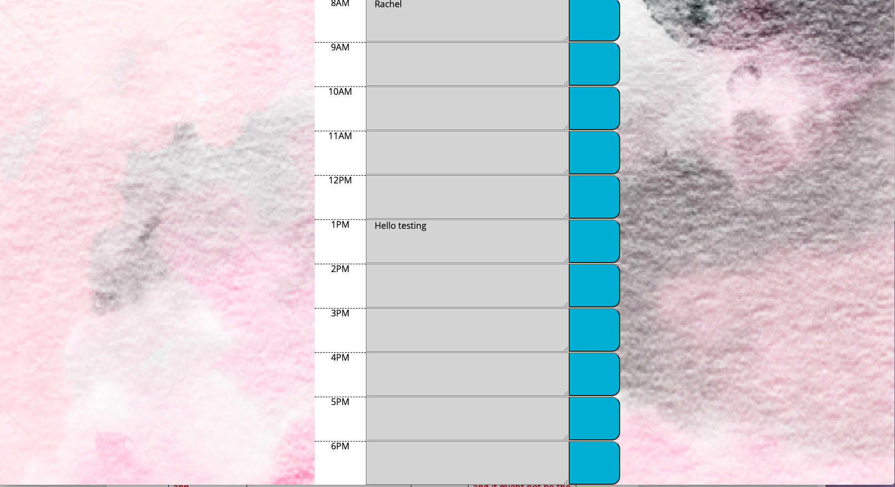
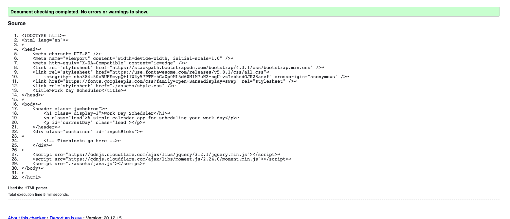
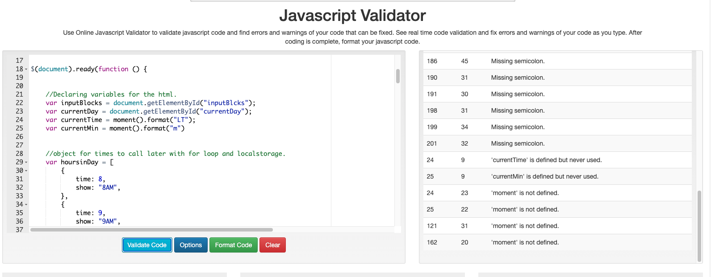

# personalcalendar

HW 5 Includes a personal planner that lays out a planner with buisness hours from 8am-6pm based on my own workplace.

When you click the button on the right it saves the event entered into local storage and remains when you refresh the page.

When time is in the past it will be gray, when time is in the present it will be red, when time is in the future it will be green.

Tweaked some CSS to personalize as well. Added a background and adjusted text size to make it easier to read.

Photo of website:

Validation:

